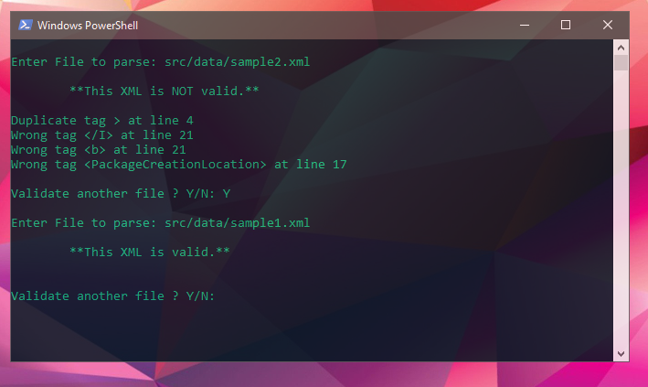

# XML Validator 
> A cli Java application for simple XML validation



## Instructions 
* Run the jar file with the command line 

```sh
java -jar .\validator.jar
```

## Description
This parser was made to test my Data structures implementations of: <br>
Stack, ArrayList, Double link list and Queue. <br>
The ADT's were provided by SAIT.